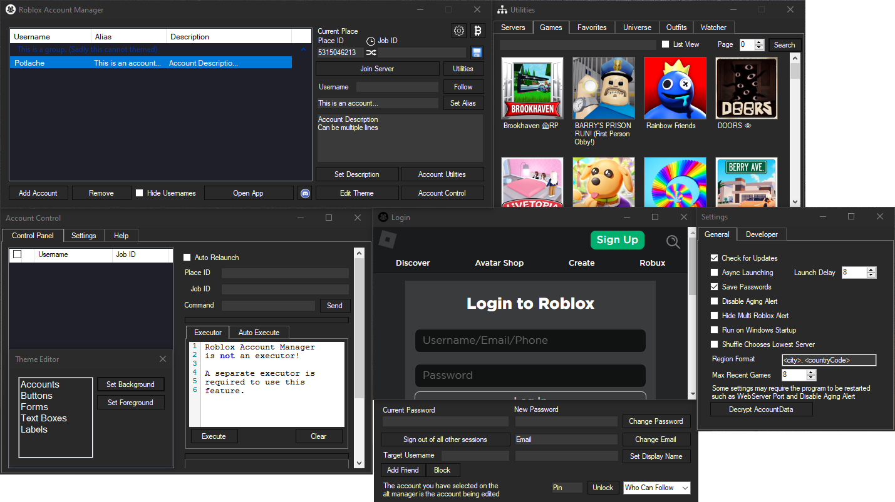

  

<h1 align="center">Roblox Account Manager Enhanced</h1>

  <b>The most powerful Roblox multi-account manager — rebuilt and improved.</b>

  
  
  

---

## About

This is an **enhanced fork** of the original [Roblox Account Manager](https://github.com/ic3w0lf22/Roblox-Account-Manager) by ic3w0lf22. While the original project was a great foundation, it has been **abandoned and is no longer maintained** — meaning critical features like Multi Roblox are broken on modern Roblox updates.

**This fork picks up where the original left off**, fixing what's broken and adding quality-of-life improvements that make managing dozens (or hundreds) of accounts seamless.

---

## What's Different? (Fork vs Original)

| Feature | Original (ic3w0lf22) | This Fork |
|---|---|---|
| **Multi Roblox** | Broken on recent Roblox updates | Fully working — bypasses `singletonMutex`, `singletonEvent`, and the new path-based `.mtx`/`.shm` singleton mechanisms |
| **Account Search** | Not available | Real-time search bar — instantly filter accounts by username, alias, or description |
| **Description Box** | Small, single-line | Large multi-line rich text box (240px) — perfect for detailed notes per account |
| **Roblox Singleton Bypass** | Only handled `ROBLOX_singletonMutex` | Handles ALL 4 singleton mechanisms Roblox uses, including kernel handle closing via Sysinternals |
| **Maintenance** | Abandoned (last update 2023) | Actively maintained and updated for the latest Roblox versions |

---

## Key Features

### Instant Account Search
Quickly find any account across your entire inventory. The search bar filters in real-time by **username**, **alias**, or **description** — essential when you're managing large numbers of accounts.

### Advanced Multi Roblox
Run **multiple Roblox instances simultaneously** without them closing each other. This fork implements a multi-layered bypass system:

- Pre-acquires `ROBLOX_singletonMutex` and `ROBLOX_singletonEvent` before any instance launches
- Automatically detects and closes singleton handles (`singletonMutex`, `singletonEvent`, `.mtx`, `.shm`) from running Roblox processes using Sysinternals' `handle.exe`
- Works even if Roblox is already running when you start the manager
- Automatically cleans up handles after each launch to prepare for the next one

### Expanded Description Box
A large, multi-line rich text area to store detailed notes for each account — track inventory, currency, level, purpose, or any information you need at a glance.

### All Original Features Included
Everything from the original project still works:

- **Encrypted Account Storage** — AES encryption with machine-bound or password-based keys
- **Server List** — Browse servers, view player count, ping, and region
- **Account Utilities** — Change password, email, privacy settings in bulk
- **VIP Server Support** — Paste any VIP link and join instantly
- **Account Control (Nexus)** — Control in-game accounts remotely via WebSocket + Lua
- **Drag & Drop Sorting** — Organize accounts with groups and drag-and-drop
- **Theme Editor** — Full UI customization with dark mode support
- **FPS Unlocker** — Built-in via ClientAppSettings patching
- **Auto Cookie Refresh** — Accounts never expire while the manager is active
- **Developer API** — Local HTTP API for external integrations
- **Quick Log In** — Log into accounts on other devices instantly
- **Auto Relaunch** — Automatically relaunch accounts that disconnect
- **Bulk Import** — Import accounts via user:pass combos or cookies

---

## Installation

1. Download the latest release from the [Releases](../../releases) page
2. Extract the ZIP to a folder on your desktop
3. Run `Roblox Account Manager.exe`

**Requirements:**
- Windows 10/11
- [.NET Framework 4.7.2+](https://dotnet.microsoft.com/download/dotnet-framework)
- [Visual C++ Redistributable (x86)](https://aka.ms/vs/16/release/vc_redist.x86.exe)

---

## How to Use Multi Roblox

1. Open the Account Manager **before** launching any Roblox instance
2. Click the **gear icon** (top right) to open Settings
3. In the **General** tab, check **Multi Roblox**
4. Select your first account, set the PlaceID/Server, click **Join Server**
5. Wait for the first account to load into the game
6. Select your second account and click **Join Server**
7. Both instances will run simultaneously

> The manager automatically handles all singleton bypasses behind the scenes. No manual configuration needed.

---

## Preview

  

---

## Credits

- **Original Project:** [Roblox Account Manager](https://github.com/ic3w0lf22/Roblox-Account-Manager) by [ic3w0lf22](https://github.com/ic3w0lf22)
- **This Fork:** Enhanced and actively maintained with new features and critical fixes

---

## Disclaimer

This software is provided as-is for educational and personal use. Use at your own risk. The developers are not responsible for any actions taken with this tool. Make sure to comply with Roblox's Terms of Service.

---

  If you find this useful, consider giving it a star.

